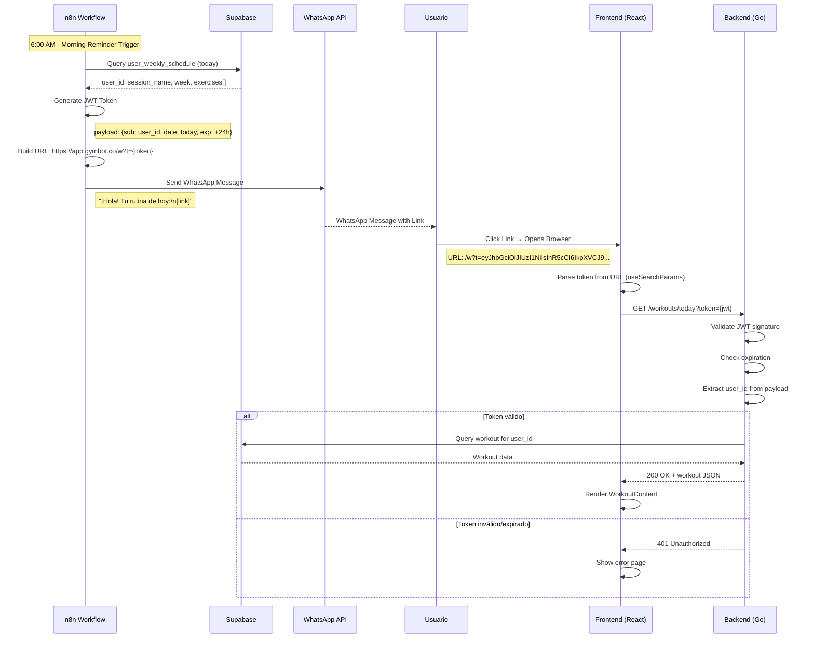
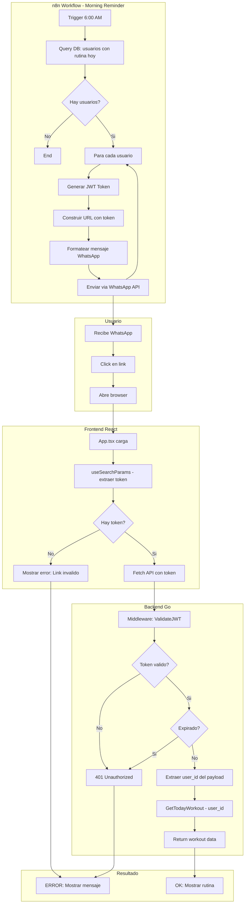
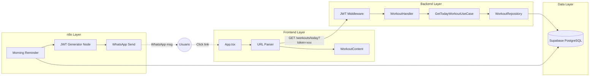

# Plan: WhatsApp Deep Link para Rutina del Día

## Objetivo
Enviar un link personalizado via WhatsApp (n8n) que al hacer click redirija al usuario a la web app mostrando su rutina del día.

**Requisitos:**
- El link debe identificar al usuario de forma segura
- No debe ser fácilmente "adivinable" por otros usuarios
- Debe tener expiración (validez de 24h)
- El frontend debe parsear el token y mostrar la rutina correspondiente

---

## Análisis del Estado Actual

### n8n (WhatsApp)
| Aspecto | Estado |
|---------|--------|
| Envío de mensajes | ✅ Funciona via WhatsApp Business API |
| Datos disponibles | ✅ `user_id`, `full_phone_number`, `session_name`, `week` |
| Morning Reminder | ✅ Envía rutina formateada a las 6 AM |

### Frontend (workout-tracker)
| Aspecto | Estado |
|---------|--------|
| Routing | ❌ No existe (single page app) |
| URL params | ❌ No parsea query strings del browser |
| User ID | ❌ Hardcodeado en `App.tsx` |
| Auth | ❌ Ninguna |

### Backend (workout-tracker-back)
| Aspecto | Estado |
|---------|--------|
| GET /workouts/today | ✅ Funciona con `?user_id=` |
| Auth middleware | ❌ No existe |
| Token validation | ❌ No existe |

---

## Arquitectura Propuesta

### Opción Recomendada: JWT Magic Link

**URL Format:**
```
https://app.gymbot.co/w?t=<JWT_TOKEN>
```

**JWT Payload:**
```json
{
  "sub": "0a220ce8-00e8-4eda-bbf4-112a7fd1e57d",  // user_id
  "date": "2026-01-30",                            // fecha de la rutina
  "exp": 1738368000,                               // expiración (24h)
  "iat": 1738281600                                // issued at
}
```

**Ventajas:**
- Seguro (firmado con secret key)
- Incluye expiración automática
- No requiere tabla adicional en DB
- Corto y manejable en WhatsApp

---

## Diagramas

### Diagrama de Secuencia: Generación y Uso del Link



### Diagrama de Flujo: Proceso Completo



### Diagrama de Componentes



---

## Archivos a Crear/Modificar

### 1. n8n Workflow (NUEVO: MorningReminder-WorkoutTracker)

| Cambio | Descripción |
|--------|-------------|
| **Nuevo workflow** | `MorningReminder-WorkoutTracker.json` (no modifica el existente) |
| Nodo: Code (JWT) | Genera JWT con user_id, date, exp |
| Nodo: WhatsApp | Envía mensaje con link a la web app |
| Config: JWT_SECRET | Variable de entorno para firmar tokens |

> **Nota:** Se crea un workflow separado para no afectar el flujo existente `RoutineMorningReminder.json` que envía la rutina detallada por WhatsApp.

### 2. Backend (workout-tracker-back)

| Archivo | Cambio |
|---------|--------|
| `internal/config/config.go` | Agregar `JWTSecret` |
| `internal/adapter/http/middleware/jwt.go` | **NUEVO** - Validar JWT |
| `internal/adapter/http/router.go` | Aplicar middleware a rutas |
| `internal/adapter/http/handler/workout_handler.go` | Extraer user_id del contexto JWT |
| `go.mod` | Agregar `github.com/golang-jwt/jwt/v5` |

### 3. Frontend (workout-tracker)

| Archivo | Cambio |
|---------|--------|
| `src/App.tsx` | Parsear `?t=` de URL, pasar token al fetch |
| `package.json` | (opcional) agregar react-router si se quiere routing |

---

## Implementación Detallada

### Paso 1: Backend - JWT Middleware

```go
// internal/adapter/http/middleware/jwt.go
package middleware

import (
    "github.com/gin-gonic/gin"
    "github.com/golang-jwt/jwt/v5"
)

type Claims struct {
    UserID string `json:"sub"`
    Date   string `json:"date"`
    jwt.RegisteredClaims
}

func ValidateJWT(secret string) gin.HandlerFunc {
    return func(c *gin.Context) {
        tokenStr := c.Query("token")
        if tokenStr == "" {
            // Fallback: check user_id for backwards compatibility
            if userID := c.Query("user_id"); userID != "" {
                c.Set("user_id", userID)
                c.Next()
                return
            }
            c.AbortWithStatusJSON(401, gin.H{"error": "token required"})
            return
        }

        token, err := jwt.ParseWithClaims(tokenStr, &Claims{}, func(t *jwt.Token) (interface{}, error) {
            return []byte(secret), nil
        })

        if err != nil || !token.Valid {
            c.AbortWithStatusJSON(401, gin.H{"error": "invalid or expired token"})
            return
        }

        claims := token.Claims.(*Claims)
        c.Set("user_id", claims.UserID)
        c.Next()
    }
}
```

### Paso 2: Backend - Modificar Handler

```go
// workout_handler.go - GetTodayWorkout
func (h *WorkoutHandler) GetTodayWorkout(c *gin.Context) {
    // Get user_id from JWT middleware context
    userID, exists := c.Get("user_id")
    if !exists {
        response.BadRequest(c, "user identification required")
        return
    }

    result, err := h.getTodayWorkoutUC.Execute(c.Request.Context(), userID.(string))
    // ... rest unchanged
}
```

### Paso 3: n8n - Code Node para JWT

```javascript
// n8n Code Node: Generate JWT
const jwt = require('jsonwebtoken');

const user_id = $input.first().json.user_id;
const JWT_SECRET = $env.JWT_SECRET; // Configurar en n8n

const token = jwt.sign(
  {
    sub: user_id,
    date: new Date().toISOString().split('T')[0], // YYYY-MM-DD
  },
  JWT_SECRET,
  { expiresIn: '24h' }
);

const workoutUrl = `https://app.gymbot.co/w?t=${token}`;

return {
  json: {
    ...$input.first().json,
    workout_url: workoutUrl,
    token: token
  }
};
```

### Paso 4: n8n - Modificar Mensaje WhatsApp

```
¡Hola, {{ $json.full_name }}! 🔥

Tu rutina de hoy está lista:

👉 {{ $json.workout_url }}

🏋️ **{{ $json.session_name }}** - Semana {{ $json.week }}

¡Dale con toda! 💪
```

### Paso 5: Frontend - Parsear Token

```typescript
// App.tsx
function App() {
  const [exercises, setExercises] = useState<ExerciseData[]>([]);
  const [loading, setLoading] = useState(true);
  const [error, setError] = useState<string | null>(null);

  useEffect(() => {
    const fetchWorkout = async () => {
      try {
        // Parse token from URL
        const params = new URLSearchParams(window.location.search);
        const token = params.get('t');

        if (!token) {
          setError('Link inválido. Por favor usa el link enviado a tu WhatsApp.');
          setLoading(false);
          return;
        }

        const response = await fetch(
          `${API_BASE_URL}/workouts/today?token=${encodeURIComponent(token)}`
        );

        if (response.status === 401) {
          setError('El link ha expirado. Solicita uno nuevo.');
          setLoading(false);
          return;
        }

        // ... rest of fetch logic
      } catch (err) {
        setError('Error de conexión');
      }
    };

    fetchWorkout();
  }, []);

  // ... render
}
```

---

## Flujo de Datos Completo

```
GENERACIÓN (6:00 AM):
  n8n Trigger
    → Query: usuarios con rutina hoy
    → Para cada usuario:
        → Code Node: jwt.sign({sub: user_id, date: today}, SECRET, {expiresIn: '24h'})
        → Build URL: https://app.gymbot.co/w?t={token}
        → WhatsApp: Enviar mensaje con link

USO (Usuario hace click):
  Browser abre: https://app.gymbot.co/w?t=eyJhbG...
    → React App.tsx: URLSearchParams.get('t')
    → Fetch: GET /workouts/today?token=eyJhbG...
    → Backend middleware: jwt.Parse(token)
        → Válido: c.Set("user_id", claims.sub)
        → Inválido: 401 Unauthorized
    → Handler: GetTodayWorkout(user_id from context)
    → Response: workout JSON
    → Frontend: Render WorkoutContent
```

---

## Configuración de Entorno

### Backend (.env)
```
JWT_SECRET=your-super-secret-key-min-32-chars
SUPABASE_DB_URL=postgresql://...
PORT=8080
```

### n8n (Environment Variables)
```
JWT_SECRET=your-super-secret-key-min-32-chars  # Mismo que backend
```

---

## Seguridad

| Aspecto | Implementación |
|---------|----------------|
| Token firmado | HMAC-SHA256 con secret compartido |
| Expiración | 24 horas desde generación |
| No adivinable | JWT con payload encriptado |
| Validación server-side | Backend verifica firma y expiración |
| Fallback | Mantiene compatibilidad con `?user_id=` para desarrollo |

---

## Verificación

1. **Backend JWT**:
   ```bash
   # Generar token de prueba
   curl "localhost:8080/workouts/today?token=<jwt_token>"
   # Debe retornar workout o 401
   ```

2. **n8n**:
   - Ejecutar Morning Reminder manualmente
   - Verificar que mensaje incluye URL con token
   - Click en link debe abrir web app

3. **Frontend**:
   - Abrir `https://app.gymbot.co/w?t=<valid_token>`
   - Debe mostrar rutina del usuario
   - Token expirado debe mostrar error amigable

4. **End-to-End**:
   - Recibir WhatsApp con link
   - Click → ver rutina en browser
   - Compartir link con otro → debe fallar (token ligado a user)

---

## Consideraciones Futuras

- **Refresh token**: Si el usuario quiere acceder después de 24h
- **PWA**: Convertir frontend en Progressive Web App para mejor UX móvil
- **Analytics**: Trackear clicks en links para medir engagement
- **Personalización URL**: Usar dominio corto (ej: `gym.bot/w?t=`)
