# Case 6 — Agente Unificado Kairos: Casos de Uso

## Caso 1: Usuario Nuevo (KYC + Primera Rutina)

> Sofia nunca ha usado GymBot. Escribe por WhatsApp por primera vez.

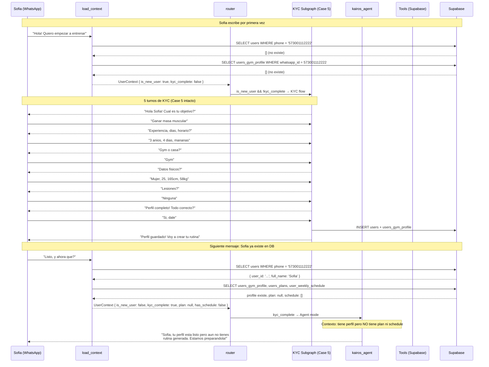

---

## Caso 2: Usuario Activo (Multiples Interacciones en un Dia)

> Camilo tiene plan activo, rutina de hoy "Upper Body A" sin completar.
> Interactua 3 veces en el dia: ve rutina, pide link del tracker, confirma.

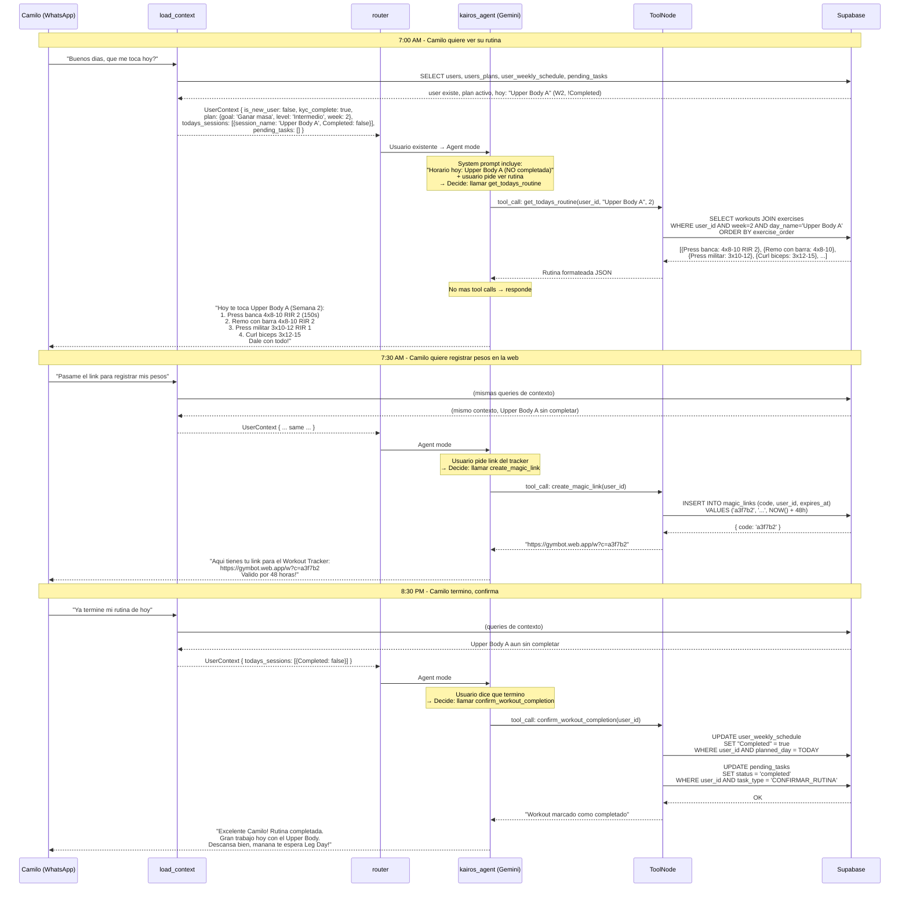

---

## Caso 3: Usuario con Tarea Pendiente + Chat Libre + Mesociclo

> Ana tiene una tarea pendiente de ayer (no confirmo si entreno).
> Luego hace preguntas de nutricion. Despues consulta su mesociclo.
> El agente prioriza la tarea pendiente, responde chat sin tools, y usa tools para mesociclo.

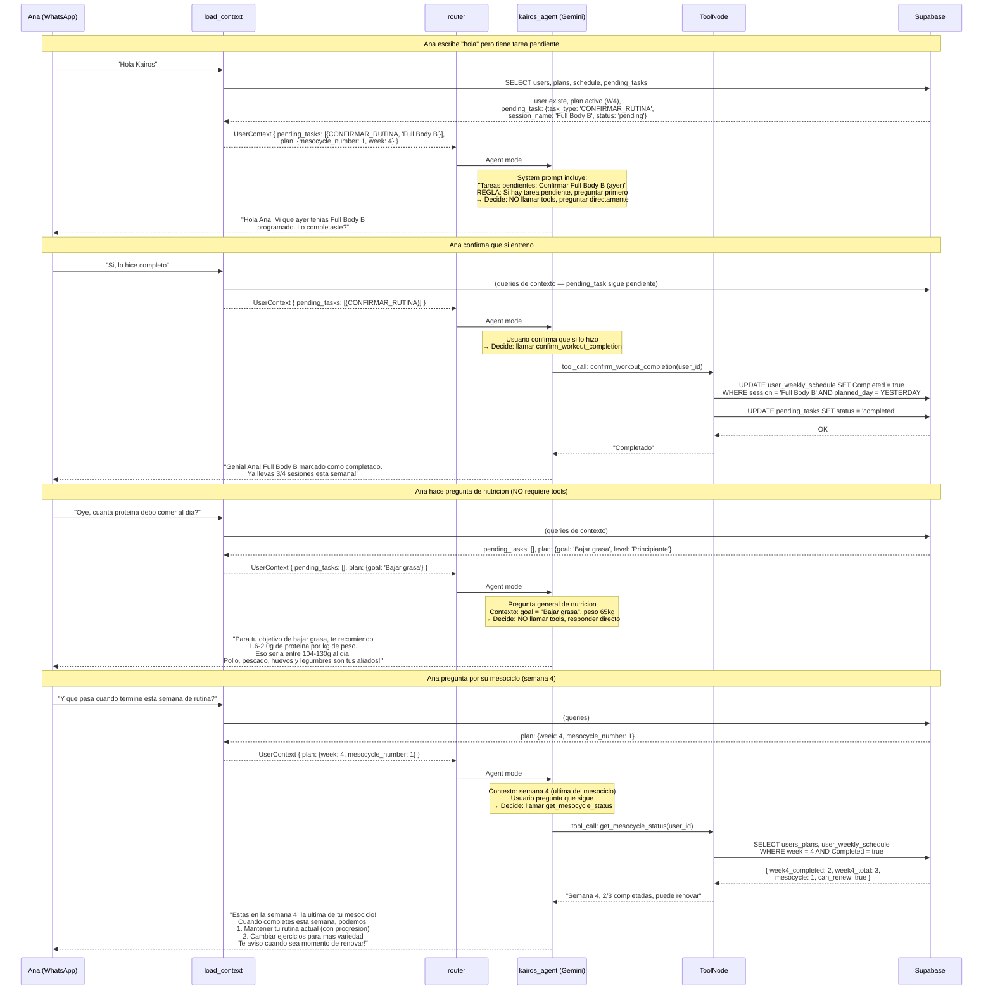

---

## Caso 4: Sesion Perdida — "Quiero entrenar hoy" (sin sesion agendada)

> Camilo entrena Lunes, Miercoles y Viernes. El Lunes no pudo ir.
> El Martes (dia de descanso) le dice al agente que quiere entrenar.
> El agente ve la sesion pendiente del Lunes y la ofrece.

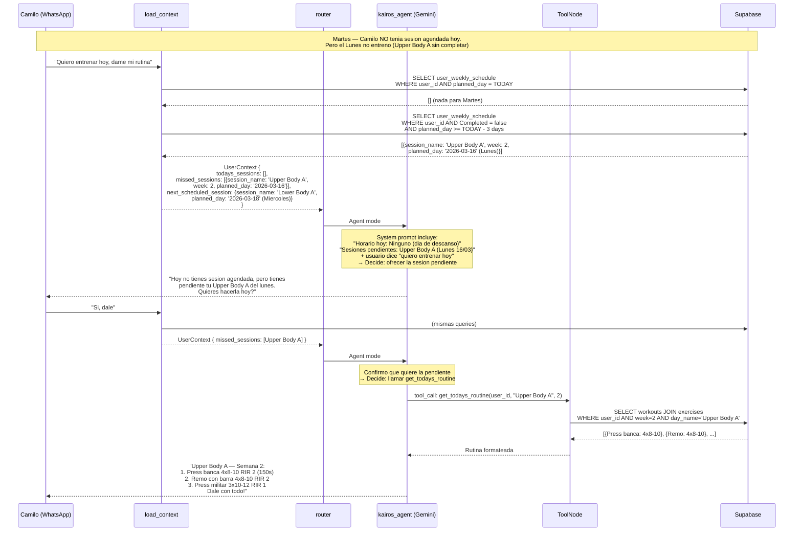

### Variante: Sin sesion pendiente

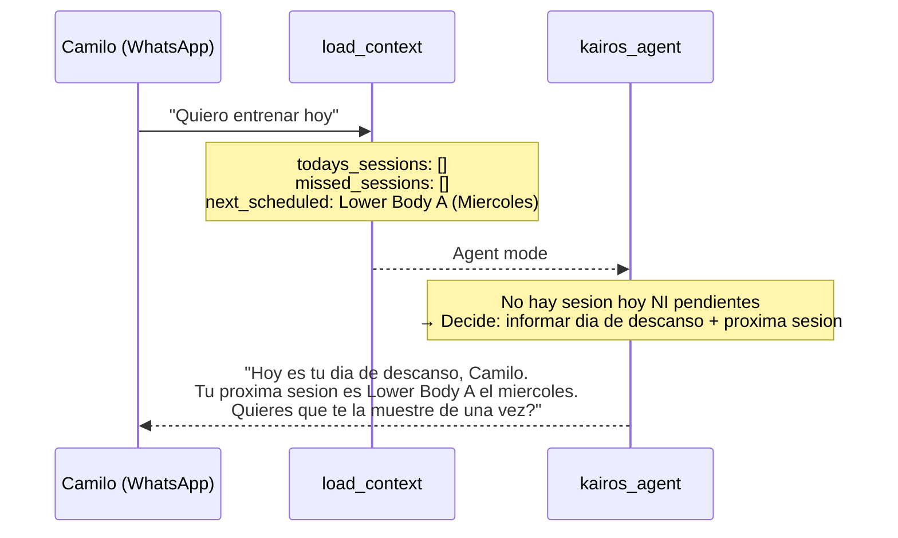

**Por que es mejor que n8n:** n8n diria "No tienes rutina hoy" y punto. El agente ve la sesion pendiente y la ofrece proactivamente.

---

## Caso 5: Chat Libre — Preguntas de Fitness (sin tools)

> Camilo ya completo su rutina del dia. Hace preguntas generales.
> El agente responde usando su conocimiento + contexto del usuario, SIN llamar tools.

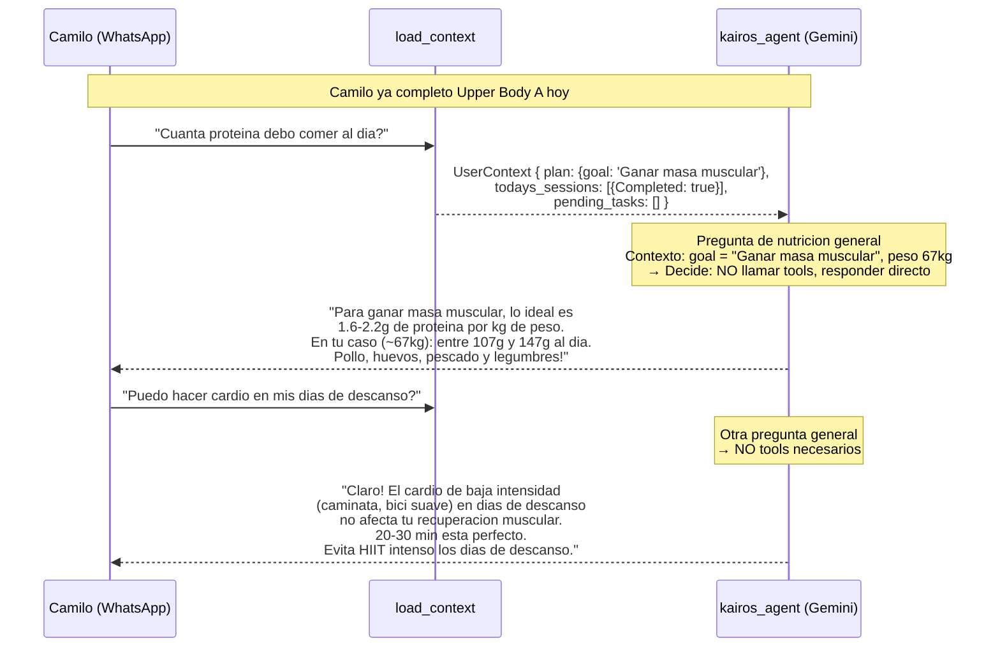

**Por que es mejor que n8n:** En n8n, CHAT va a un AI Agent generico sin contexto del usuario. Aqui el agente sabe que Camilo busca ganar masa y pesa 67kg — personaliza la respuesta.

---

## Caso 6: Renovacion de Mesociclo — Semana 4 Completada

> Ana completo todas las sesiones de semana 4. El agente detecta que puede renovar.
> Ana pide mantener pero cambiar de 4 a 5 dias.

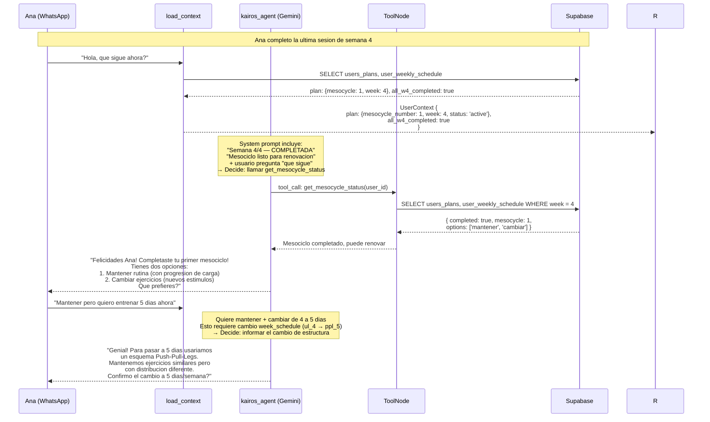

**Por que es mejor que n8n:** En n8n, la renovacion requiere un subworkflow completo (GymBotMesocycleRenewal) con Wait nodes. El agente lo maneja en conversacion natural.

---

## Caso 7: Agendamiento Flexible

> Camilo tiene plan pero NO tiene dias programados.
> El agente detecta la falta de schedule y ayuda a programar.

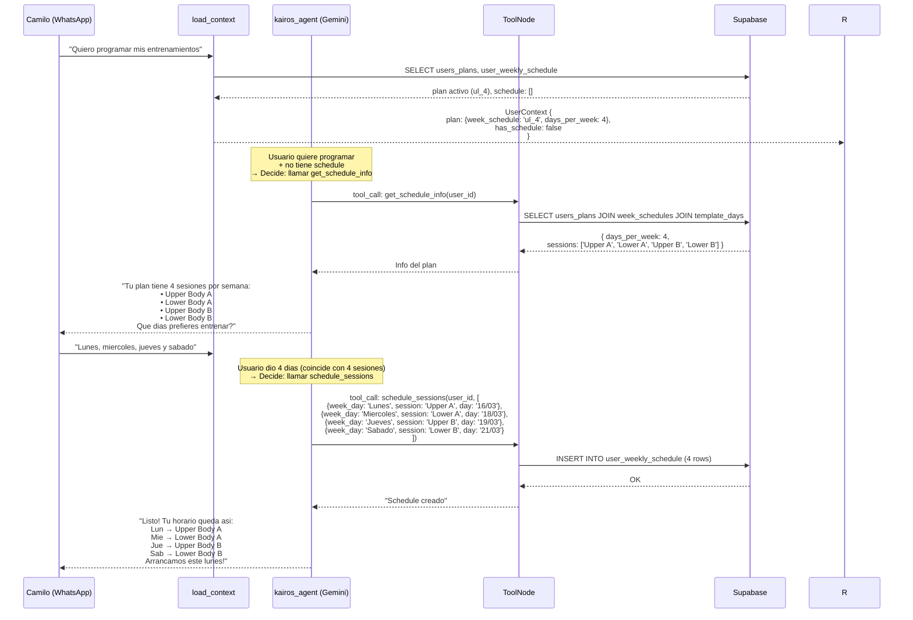

---

## Caso 8: Creacion de Rutina — Draft Mode con Feedback

> Sofia acaba de completar el KYC. El agente le ofrece crear su rutina.
> Le pregunta como prefiere el proceso. Sofia elige ver todo junto.
> El agente genera un borrador, Sofia pide un cambio, el agente ajusta y guarda.

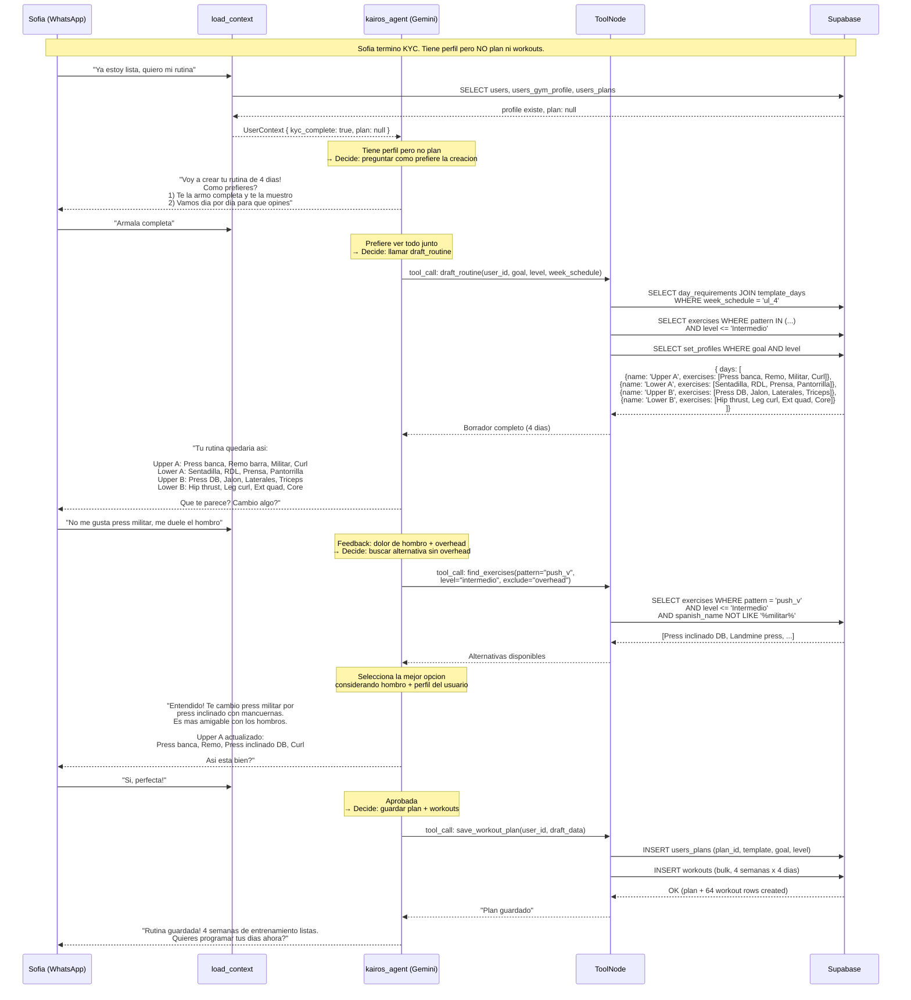

### Variante: Dia por dia

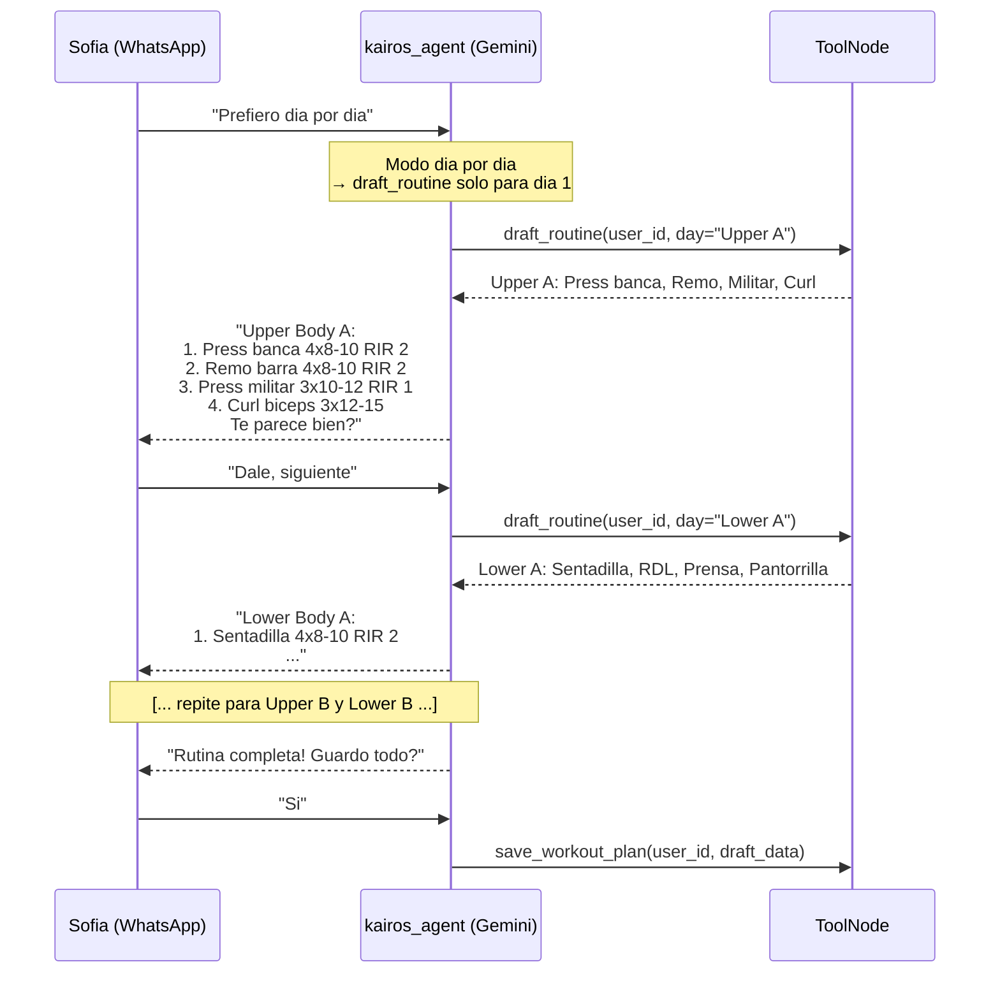

### Variante: Cambio directo sin borrador

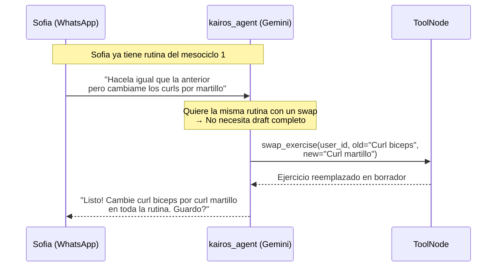

**Por que es mejor que n8n:** En n8n, WORKOUT_CREATOR es una caja negra: entra perfil, sale rutina. El usuario no puede opinar durante la creacion. Aqui el agente presenta borradores, acepta feedback, y ajusta antes de guardar.

---

## Arquitectura General

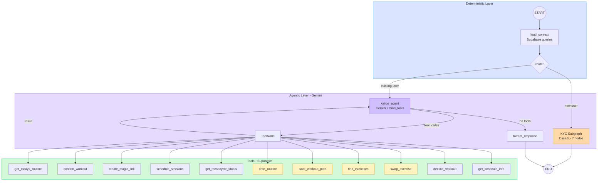

---

## Resumen: Como el Agente Decide

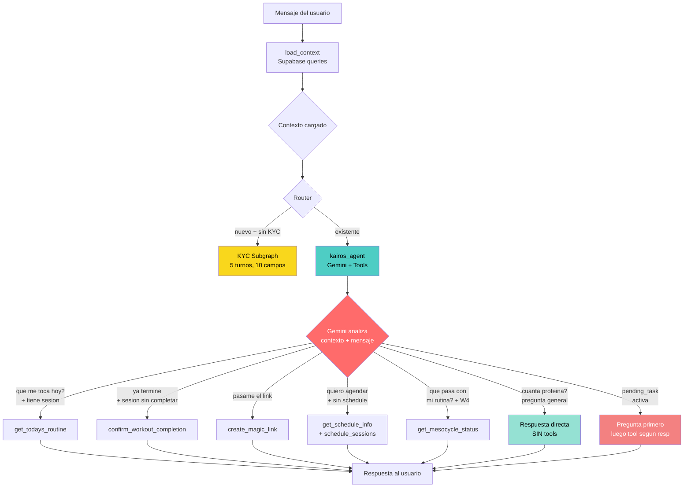

## Punto Clave

El agente **NO tiene un Switch de intenciones**. Gemini recibe:
1. **Contexto** (plan, sesiones, tareas pendientes, semana del mesociclo)
2. **Mensaje** del usuario
3. **Tools** disponibles

Y **decide libremente** que hacer. Mismos mensajes pueden producir acciones diferentes segun el contexto:

| Mensaje | Contexto A | Contexto B |
|---------|-----------|-----------|
| "Hola" | Sin pending_task → saludo normal | Con pending_task → pregunta si completo rutina |
| "Ya termine" | Sesion hoy sin completar → `confirm_workout_completion` | Sin sesion hoy → "No tienes rutina programada hoy" |
| "Que sigue?" | Semana 2 → muestra rutina de manana | Semana 4 → `get_mesocycle_status` |
| "Quiero entrenar" | Sin schedule → ofrece agendar | Con schedule → muestra rutina de hoy |

---

## Agente vs n8n — Comparacion

| Escenario | n8n (Switch rigido) | Agente (Gemini + tools) |
|-----------|--------------------|-----------------------|
| Sesion perdida, quiere entrenar | "No tienes rutina hoy" | Ofrece sesion pendiente |
| Pending task + pregunta | Maneja pending task O pregunta, no ambos | Pregunta por pending, luego responde |
| Chat personalizado | AI Agent generico sin contexto | Responde con datos del perfil del usuario |
| Renovacion + cambio de dias | Requiere subworkflow completo | Conversacion natural, 2-3 mensajes |
| "Quiero el link del tracker" | No existe esta intencion | Agente entiende y genera magic link |
| Multiples intenciones en 1 msg | Solo detecta la primera | Razona sobre todo el mensaje |
