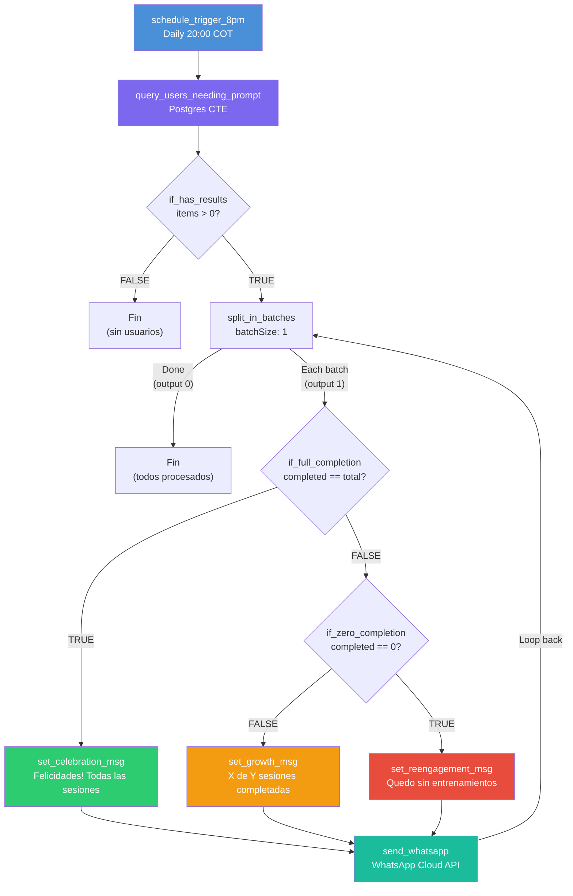
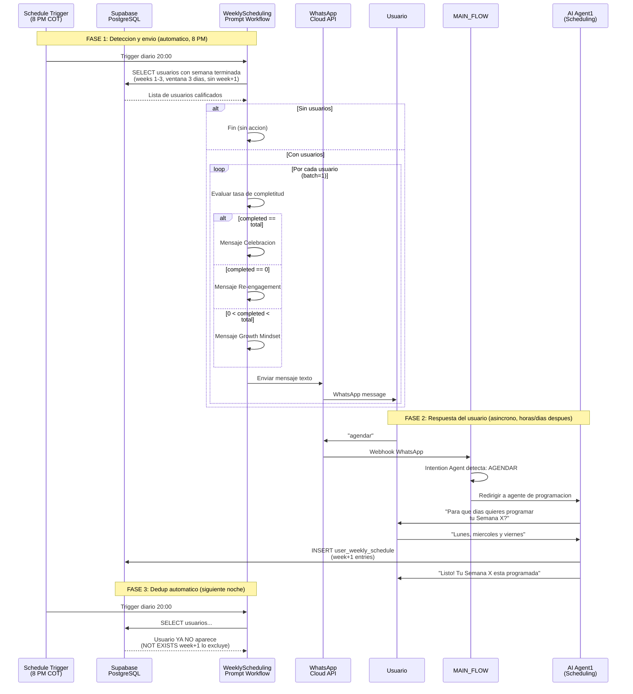
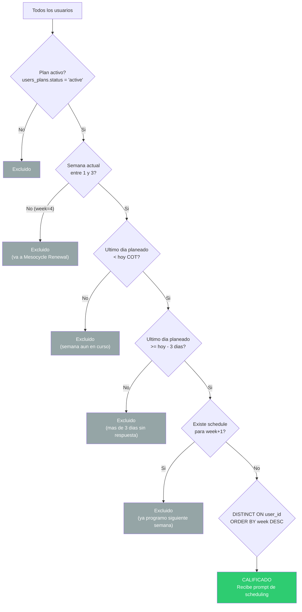
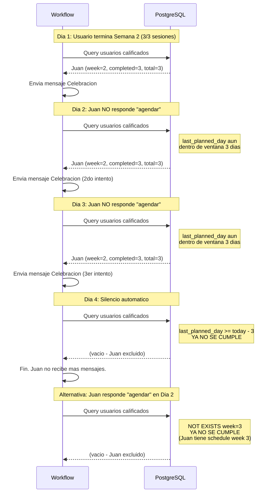
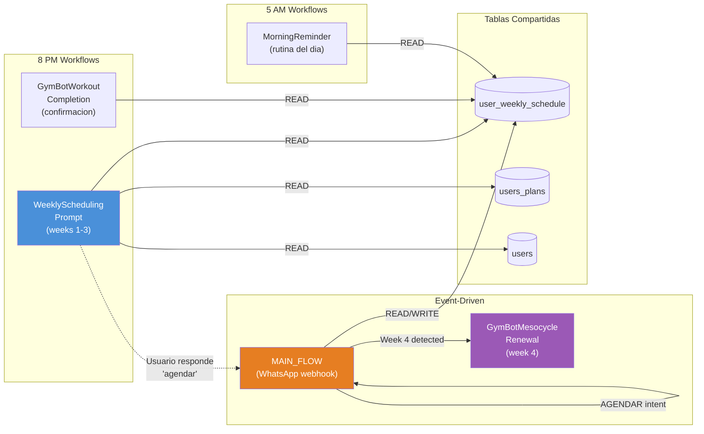
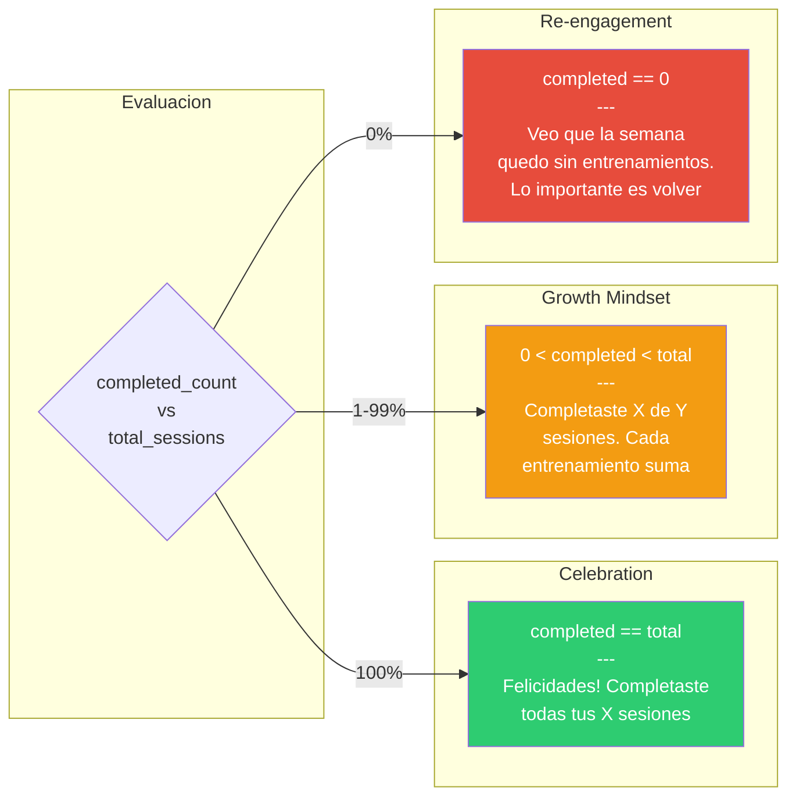

# Weekly Scheduling Prompt — Diagramas (KAN-61)

## 1. Diagrama de Flujo del Workflow

## 2. Diagrama de Secuencia — Flujo Completo (Prompt + Respuesta)

## 3. Diagrama de Flujo — Logica SQL de Deteccion

## 4. Diagrama de Secuencia — Estrategia de Dedup

## 5. Mapa de Integracion entre Workflows

## 6. Tabla de Variantes de Mensaje

